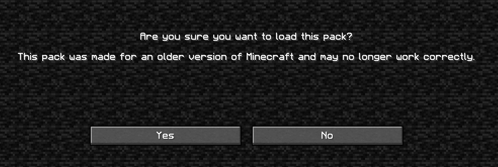

Resource-Pack-Updater.py updates one or all Minecraft resource packs to a specific version.
In practice, you would use it to update all your resource packs at once when a new Minecraft update comes out. This would prevent the in-game warning as shown below.
This only changes the hard-coded version, it does NOT change the texture pack in any way (including any actual updates it might require)

# Usage

1. Place `Resource-Pack-Updater.py` in the same directory as the resource packs (`.minecraft/resourcepacks`)
2. Open terminal, run `python Resource-Pack-Updater`
3. Input name of resource pack (not including `.zip`), or `all` to update all packs
4. Input version to update to
